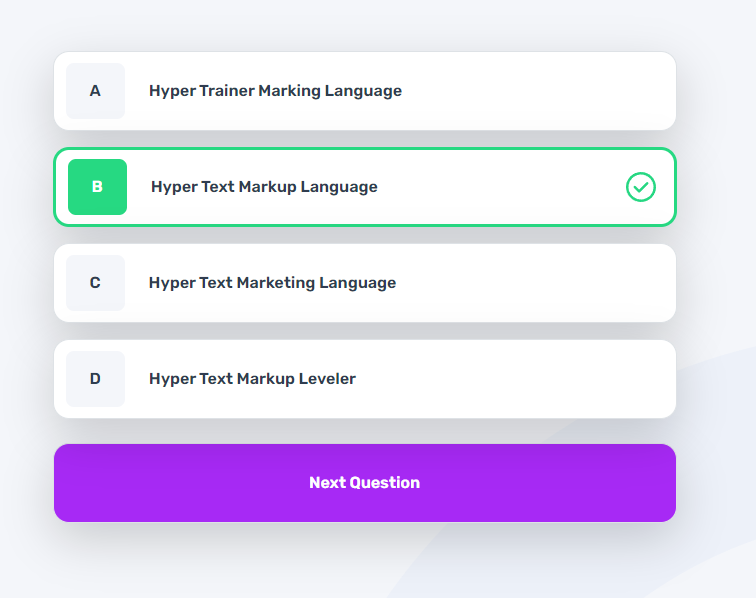

# Frontend Mentor - Frontend quiz app solution

This is a solution to the [Frontend quiz app challenge on Frontend Mentor](https://www.frontendmentor.io/challenges/frontend-quiz-app-BE7xkzXQnU). Frontend Mentor challenges help you improve your coding skills by building realistic projects. 

## Table of contents

- [Overview](#overview)
  - [The challenge](#the-challenge)
  - [Screenshot](#screenshot)
  - [Links](#links)
- [My process](#my-process)
  - [Built with](#built-with)
  - [What I learned](#what-i-learned)
  - [Continued development](#continued-development)
- [Author](#author)
- [Acknowledgments](#acknowledgments)

## Overview

### The challenge

Users should be able to:

- Select a quiz subject
- Select a single answer from each question from a choice of four
- See an error message when trying to submit an answer without making a selection
- See if they have made a correct or incorrect choice when they submit an answer
- Move on to the next question after seeing the question result
- See a completed state with the score after the final question
- Play again to choose another subject
- View the optimal layout for the interface depending on their device's screen size
- See hover and focus states for all interactive elements on the page
- Navigate the entire app only using their keyboard
- **Bonus**: Change the app's theme between light and dark

### Screenshot

### Links

- Solution URL: [Add solution URL here](https://github.com/DEAckeret/frontend-quiz-app)
- Live Site URL: [Add live site URL here](https://deackeret.github.io/frontend-quiz-app/)

## My process

### Built with

- Bootstrap
- Jquery
- Sass
- MutationObserver
- Webpack

### What I learned

This was a fun application to make! I actually started this project a while back and decided to set it aside so I could focus on learning Jquery and Bootstrap in a smaller more manageable project. 

When I came back to this project, I felt more confident with those two technologies but needed to simply role with what I had already created and balance it with what I had learned in the mean time. 

I felt good about creating reusable functions that all quiz subjects could utilize. After I had built everything in my JS file, I thought about how I could optimize it even more. 

I also learned about the MutationObserver API which I used for adding utility classes for my dynamically added elements. In the future I want to learn more about this API and other API's and how they can help with my work flow. 

### Continued development

From this point on I would like to maybe venture into React. I know that React could have made this project even easier with components and state management.

## Author

- Frontend Mentor - [@DEAckeret](https://www.frontendmentor.io/profile/DEAckeret)

## Acknowledgments

Speacial thanks to Frontend Mentor for providing this challenge and design files! It was really fun and look forward to making the next one!
